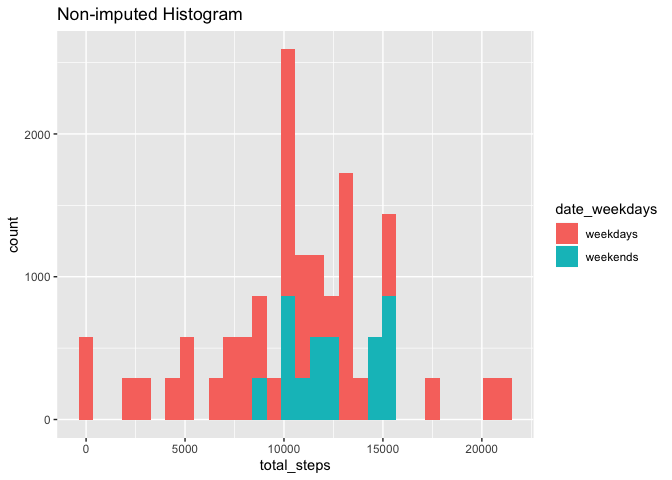
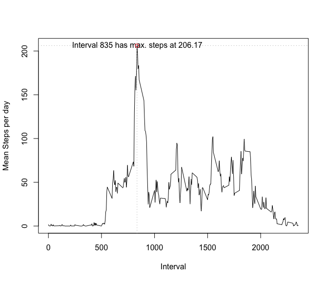
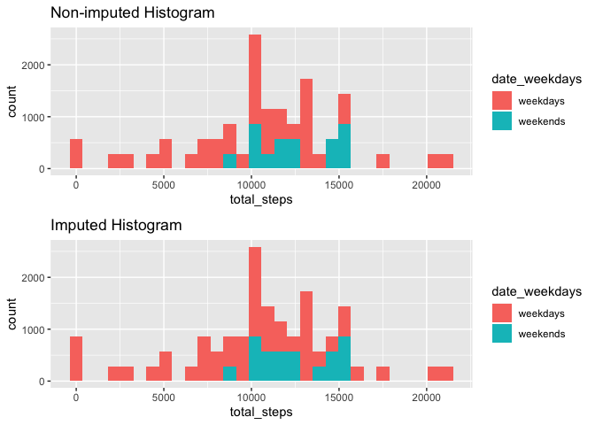
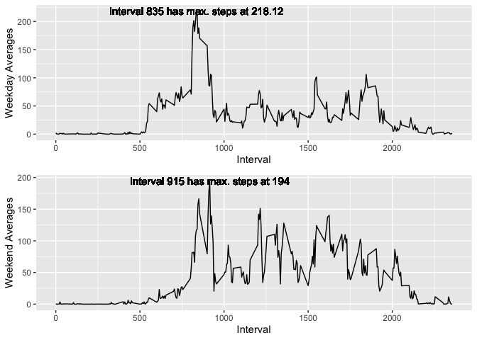

## Loading and preprocessing the data
1. Read and Clean the data

```r
act_df <- read.csv("data/activity.csv")
str(act_df)
```

```
## 'data.frame':	17568 obs. of  3 variables:
##  $ steps   : int  NA NA NA NA NA NA NA NA NA NA ...
##  $ date    : Factor w/ 61 levels "2012-10-01","2012-10-02",..: 1 1 1 1 1 1 1 1 1 1 ...
##  $ interval: int  0 5 10 15 20 25 30 35 40 45 ...
```
2. Study the data
For 61 days the data is collected in 288 intervals. There are  

```r
length(unique(act_df$interval)) * length(unique(act_df$date))
```

```
## [1] 17568
```

```r
dim(act_df)
```

```
## [1] 17568     3
```

```r
library(xtable)
xt <- xtable(summary(act_df))
print(xt, type = "html")
```

```
## <!-- html table generated in R 3.5.2 by xtable 1.8-4 package -->
## <!-- Tue Aug 27 18:42:02 2019 -->
## <table border=1>
## <tr> <th>  </th> <th>     steps </th> <th>         date </th> <th>    interval </th>  </tr>
##   <tr> <td align="right"> X </td> <td> Min.   :  0.00   </td> <td> 2012-10-01:  288   </td> <td> Min.   :   0.0   </td> </tr>
##   <tr> <td align="right"> X.1 </td> <td> 1st Qu.:  0.00   </td> <td> 2012-10-02:  288   </td> <td> 1st Qu.: 588.8   </td> </tr>
##   <tr> <td align="right"> X.2 </td> <td> Median :  0.00   </td> <td> 2012-10-03:  288   </td> <td> Median :1177.5   </td> </tr>
##   <tr> <td align="right"> X.3 </td> <td> Mean   : 37.38   </td> <td> 2012-10-04:  288   </td> <td> Mean   :1177.5   </td> </tr>
##   <tr> <td align="right"> X.4 </td> <td> 3rd Qu.: 12.00   </td> <td> 2012-10-05:  288   </td> <td> 3rd Qu.:1766.2   </td> </tr>
##   <tr> <td align="right"> X.5 </td> <td> Max.   :806.00   </td> <td> 2012-10-06:  288   </td> <td> Max.   :2355.0   </td> </tr>
##   <tr> <td align="right"> X.6 </td> <td> NA's   :2304   </td> <td> (Other)   :15840   </td> <td>  </td> </tr>
##    </table>
```
## What is mean total number of steps taken per day?
1. Use the dplyr library to group_by date and omit the NA

```r
library(dplyr)
library(ggplot2)
act_proc <- act_df %>% na.omit() %>% 
    group_by(date) %>% summarise(median_daily_steps = ((steps[144] + 
    steps[145])/2), steps_total = sum(steps), 
    step_interval_count = n()) %>% mutate(mean_daily_steps = as.numeric(format(round(steps_total/step_interval_count, 
    2), 2)))


weekdays <- weekdays(Sys.Date() + 0:6)[weekdays(Sys.Date() + 
    0:6) != c("Saturday", "Sunday")]
weekends <- weekdays(Sys.Date() + 0:6)[weekdays(Sys.Date() + 
    0:6) == c("Saturday", "Sunday")]

act_df_weekday_label <- act_df %>% mutate(date_weekdays = if_else(weekdays(as.Date(act_df$date)) %in% 
    weekdays, "weekdays", if_else(weekdays(as.Date(act_df$date)) %in% 
    weekends, "weekends", "NONE")))

unique(act_df_weekday_label$date_weekdays)
```

```
## [1] "weekdays" "weekends"
```

```r
unique(format(as.Date(act_df_weekday_label$date), 
    "%A"))
```

```
## [1] "Monday"    "Tuesday"   "Wednesday" "Thursday"  "Friday"    "Saturday" 
## [7] "Sunday"
```
2. Make a histogram of the total number of steps taken each day


```r
df_hist1 <- act_df_weekday_label %>% 
    group_by(date) %>% mutate(total_steps = sum(steps))
g1 <- ggplot(data = df_hist1) + geom_histogram(aes(total_steps, 
    fill = date_weekdays)) + labs(title = "Non-imputed Histogram")
g1
```

<!-- -->
3. Calculate and report the mean and median of the total number of steps taken per day


```r
library(kableExtra)
act_proc %>% kable() %>% kable_styling(bootstrap_options = c("striped", 
    "hover", "condensed", full_width = F))
```

<table class="table table-striped table-hover table-condensed" style="margin-left: auto; margin-right: auto;">
 <thead>
  <tr>
   <th style="text-align:left;"> date </th>
   <th style="text-align:right;"> median_daily_steps </th>
   <th style="text-align:right;"> steps_total </th>
   <th style="text-align:right;"> step_interval_count </th>
   <th style="text-align:right;"> mean_daily_steps </th>
  </tr>
 </thead>
<tbody>
  <tr>
   <td style="text-align:left;"> 2012-10-02 </td>
   <td style="text-align:right;"> 0.0 </td>
   <td style="text-align:right;"> 126 </td>
   <td style="text-align:right;"> 288 </td>
   <td style="text-align:right;"> 0.44 </td>
  </tr>
  <tr>
   <td style="text-align:left;"> 2012-10-03 </td>
   <td style="text-align:right;"> 106.5 </td>
   <td style="text-align:right;"> 11352 </td>
   <td style="text-align:right;"> 288 </td>
   <td style="text-align:right;"> 39.42 </td>
  </tr>
  <tr>
   <td style="text-align:left;"> 2012-10-04 </td>
   <td style="text-align:right;"> 80.0 </td>
   <td style="text-align:right;"> 12116 </td>
   <td style="text-align:right;"> 288 </td>
   <td style="text-align:right;"> 42.07 </td>
  </tr>
  <tr>
   <td style="text-align:left;"> 2012-10-05 </td>
   <td style="text-align:right;"> 69.0 </td>
   <td style="text-align:right;"> 13294 </td>
   <td style="text-align:right;"> 288 </td>
   <td style="text-align:right;"> 46.16 </td>
  </tr>
  <tr>
   <td style="text-align:left;"> 2012-10-06 </td>
   <td style="text-align:right;"> 146.5 </td>
   <td style="text-align:right;"> 15420 </td>
   <td style="text-align:right;"> 288 </td>
   <td style="text-align:right;"> 53.54 </td>
  </tr>
  <tr>
   <td style="text-align:left;"> 2012-10-07 </td>
   <td style="text-align:right;"> 26.0 </td>
   <td style="text-align:right;"> 11015 </td>
   <td style="text-align:right;"> 288 </td>
   <td style="text-align:right;"> 38.25 </td>
  </tr>
  <tr>
   <td style="text-align:left;"> 2012-10-09 </td>
   <td style="text-align:right;"> 124.5 </td>
   <td style="text-align:right;"> 12811 </td>
   <td style="text-align:right;"> 288 </td>
   <td style="text-align:right;"> 44.48 </td>
  </tr>
  <tr>
   <td style="text-align:left;"> 2012-10-10 </td>
   <td style="text-align:right;"> 47.5 </td>
   <td style="text-align:right;"> 9900 </td>
   <td style="text-align:right;"> 288 </td>
   <td style="text-align:right;"> 34.38 </td>
  </tr>
  <tr>
   <td style="text-align:left;"> 2012-10-11 </td>
   <td style="text-align:right;"> 0.0 </td>
   <td style="text-align:right;"> 10304 </td>
   <td style="text-align:right;"> 288 </td>
   <td style="text-align:right;"> 35.78 </td>
  </tr>
  <tr>
   <td style="text-align:left;"> 2012-10-12 </td>
   <td style="text-align:right;"> 35.0 </td>
   <td style="text-align:right;"> 17382 </td>
   <td style="text-align:right;"> 288 </td>
   <td style="text-align:right;"> 60.35 </td>
  </tr>
  <tr>
   <td style="text-align:left;"> 2012-10-13 </td>
   <td style="text-align:right;"> 11.5 </td>
   <td style="text-align:right;"> 12426 </td>
   <td style="text-align:right;"> 288 </td>
   <td style="text-align:right;"> 43.15 </td>
  </tr>
  <tr>
   <td style="text-align:left;"> 2012-10-14 </td>
   <td style="text-align:right;"> 0.0 </td>
   <td style="text-align:right;"> 15098 </td>
   <td style="text-align:right;"> 288 </td>
   <td style="text-align:right;"> 52.42 </td>
  </tr>
  <tr>
   <td style="text-align:left;"> 2012-10-15 </td>
   <td style="text-align:right;"> 0.0 </td>
   <td style="text-align:right;"> 10139 </td>
   <td style="text-align:right;"> 288 </td>
   <td style="text-align:right;"> 35.20 </td>
  </tr>
  <tr>
   <td style="text-align:left;"> 2012-10-16 </td>
   <td style="text-align:right;"> 0.0 </td>
   <td style="text-align:right;"> 15084 </td>
   <td style="text-align:right;"> 288 </td>
   <td style="text-align:right;"> 52.38 </td>
  </tr>
  <tr>
   <td style="text-align:left;"> 2012-10-17 </td>
   <td style="text-align:right;"> 0.0 </td>
   <td style="text-align:right;"> 13452 </td>
   <td style="text-align:right;"> 288 </td>
   <td style="text-align:right;"> 46.71 </td>
  </tr>
  <tr>
   <td style="text-align:left;"> 2012-10-18 </td>
   <td style="text-align:right;"> 0.0 </td>
   <td style="text-align:right;"> 10056 </td>
   <td style="text-align:right;"> 288 </td>
   <td style="text-align:right;"> 34.92 </td>
  </tr>
  <tr>
   <td style="text-align:left;"> 2012-10-19 </td>
   <td style="text-align:right;"> 0.0 </td>
   <td style="text-align:right;"> 11829 </td>
   <td style="text-align:right;"> 288 </td>
   <td style="text-align:right;"> 41.07 </td>
  </tr>
  <tr>
   <td style="text-align:left;"> 2012-10-20 </td>
   <td style="text-align:right;"> 0.0 </td>
   <td style="text-align:right;"> 10395 </td>
   <td style="text-align:right;"> 288 </td>
   <td style="text-align:right;"> 36.09 </td>
  </tr>
  <tr>
   <td style="text-align:left;"> 2012-10-21 </td>
   <td style="text-align:right;"> 74.5 </td>
   <td style="text-align:right;"> 8821 </td>
   <td style="text-align:right;"> 288 </td>
   <td style="text-align:right;"> 30.63 </td>
  </tr>
  <tr>
   <td style="text-align:left;"> 2012-10-22 </td>
   <td style="text-align:right;"> 498.0 </td>
   <td style="text-align:right;"> 13460 </td>
   <td style="text-align:right;"> 288 </td>
   <td style="text-align:right;"> 46.74 </td>
  </tr>
  <tr>
   <td style="text-align:left;"> 2012-10-23 </td>
   <td style="text-align:right;"> 327.5 </td>
   <td style="text-align:right;"> 8918 </td>
   <td style="text-align:right;"> 288 </td>
   <td style="text-align:right;"> 30.97 </td>
  </tr>
  <tr>
   <td style="text-align:left;"> 2012-10-24 </td>
   <td style="text-align:right;"> 0.0 </td>
   <td style="text-align:right;"> 8355 </td>
   <td style="text-align:right;"> 288 </td>
   <td style="text-align:right;"> 29.01 </td>
  </tr>
  <tr>
   <td style="text-align:left;"> 2012-10-25 </td>
   <td style="text-align:right;"> 0.0 </td>
   <td style="text-align:right;"> 2492 </td>
   <td style="text-align:right;"> 288 </td>
   <td style="text-align:right;"> 8.65 </td>
  </tr>
  <tr>
   <td style="text-align:left;"> 2012-10-26 </td>
   <td style="text-align:right;"> 0.0 </td>
   <td style="text-align:right;"> 6778 </td>
   <td style="text-align:right;"> 288 </td>
   <td style="text-align:right;"> 23.53 </td>
  </tr>
  <tr>
   <td style="text-align:left;"> 2012-10-27 </td>
   <td style="text-align:right;"> 43.5 </td>
   <td style="text-align:right;"> 10119 </td>
   <td style="text-align:right;"> 288 </td>
   <td style="text-align:right;"> 35.14 </td>
  </tr>
  <tr>
   <td style="text-align:left;"> 2012-10-28 </td>
   <td style="text-align:right;"> 54.0 </td>
   <td style="text-align:right;"> 11458 </td>
   <td style="text-align:right;"> 288 </td>
   <td style="text-align:right;"> 39.78 </td>
  </tr>
  <tr>
   <td style="text-align:left;"> 2012-10-29 </td>
   <td style="text-align:right;"> 0.0 </td>
   <td style="text-align:right;"> 5018 </td>
   <td style="text-align:right;"> 288 </td>
   <td style="text-align:right;"> 17.42 </td>
  </tr>
  <tr>
   <td style="text-align:left;"> 2012-10-30 </td>
   <td style="text-align:right;"> 0.0 </td>
   <td style="text-align:right;"> 9819 </td>
   <td style="text-align:right;"> 288 </td>
   <td style="text-align:right;"> 34.09 </td>
  </tr>
  <tr>
   <td style="text-align:left;"> 2012-10-31 </td>
   <td style="text-align:right;"> 0.0 </td>
   <td style="text-align:right;"> 15414 </td>
   <td style="text-align:right;"> 288 </td>
   <td style="text-align:right;"> 53.52 </td>
  </tr>
  <tr>
   <td style="text-align:left;"> 2012-11-02 </td>
   <td style="text-align:right;"> 0.0 </td>
   <td style="text-align:right;"> 10600 </td>
   <td style="text-align:right;"> 288 </td>
   <td style="text-align:right;"> 36.81 </td>
  </tr>
  <tr>
   <td style="text-align:left;"> 2012-11-03 </td>
   <td style="text-align:right;"> 86.0 </td>
   <td style="text-align:right;"> 10571 </td>
   <td style="text-align:right;"> 288 </td>
   <td style="text-align:right;"> 36.70 </td>
  </tr>
  <tr>
   <td style="text-align:left;"> 2012-11-05 </td>
   <td style="text-align:right;"> 0.0 </td>
   <td style="text-align:right;"> 10439 </td>
   <td style="text-align:right;"> 288 </td>
   <td style="text-align:right;"> 36.25 </td>
  </tr>
  <tr>
   <td style="text-align:left;"> 2012-11-06 </td>
   <td style="text-align:right;"> 0.0 </td>
   <td style="text-align:right;"> 8334 </td>
   <td style="text-align:right;"> 288 </td>
   <td style="text-align:right;"> 28.94 </td>
  </tr>
  <tr>
   <td style="text-align:left;"> 2012-11-07 </td>
   <td style="text-align:right;"> 42.0 </td>
   <td style="text-align:right;"> 12883 </td>
   <td style="text-align:right;"> 288 </td>
   <td style="text-align:right;"> 44.73 </td>
  </tr>
  <tr>
   <td style="text-align:left;"> 2012-11-08 </td>
   <td style="text-align:right;"> 0.0 </td>
   <td style="text-align:right;"> 3219 </td>
   <td style="text-align:right;"> 288 </td>
   <td style="text-align:right;"> 11.18 </td>
  </tr>
  <tr>
   <td style="text-align:left;"> 2012-11-11 </td>
   <td style="text-align:right;"> 234.0 </td>
   <td style="text-align:right;"> 12608 </td>
   <td style="text-align:right;"> 288 </td>
   <td style="text-align:right;"> 43.78 </td>
  </tr>
  <tr>
   <td style="text-align:left;"> 2012-11-12 </td>
   <td style="text-align:right;"> 0.0 </td>
   <td style="text-align:right;"> 10765 </td>
   <td style="text-align:right;"> 288 </td>
   <td style="text-align:right;"> 37.38 </td>
  </tr>
  <tr>
   <td style="text-align:left;"> 2012-11-13 </td>
   <td style="text-align:right;"> 30.0 </td>
   <td style="text-align:right;"> 7336 </td>
   <td style="text-align:right;"> 288 </td>
   <td style="text-align:right;"> 25.47 </td>
  </tr>
  <tr>
   <td style="text-align:left;"> 2012-11-15 </td>
   <td style="text-align:right;"> 0.0 </td>
   <td style="text-align:right;"> 41 </td>
   <td style="text-align:right;"> 288 </td>
   <td style="text-align:right;"> 0.14 </td>
  </tr>
  <tr>
   <td style="text-align:left;"> 2012-11-16 </td>
   <td style="text-align:right;"> 310.5 </td>
   <td style="text-align:right;"> 5441 </td>
   <td style="text-align:right;"> 288 </td>
   <td style="text-align:right;"> 18.89 </td>
  </tr>
  <tr>
   <td style="text-align:left;"> 2012-11-17 </td>
   <td style="text-align:right;"> 19.5 </td>
   <td style="text-align:right;"> 14339 </td>
   <td style="text-align:right;"> 288 </td>
   <td style="text-align:right;"> 49.79 </td>
  </tr>
  <tr>
   <td style="text-align:left;"> 2012-11-18 </td>
   <td style="text-align:right;"> 38.5 </td>
   <td style="text-align:right;"> 15110 </td>
   <td style="text-align:right;"> 288 </td>
   <td style="text-align:right;"> 52.47 </td>
  </tr>
  <tr>
   <td style="text-align:left;"> 2012-11-19 </td>
   <td style="text-align:right;"> 15.0 </td>
   <td style="text-align:right;"> 8841 </td>
   <td style="text-align:right;"> 288 </td>
   <td style="text-align:right;"> 30.70 </td>
  </tr>
  <tr>
   <td style="text-align:left;"> 2012-11-20 </td>
   <td style="text-align:right;"> 65.0 </td>
   <td style="text-align:right;"> 4472 </td>
   <td style="text-align:right;"> 288 </td>
   <td style="text-align:right;"> 15.53 </td>
  </tr>
  <tr>
   <td style="text-align:left;"> 2012-11-21 </td>
   <td style="text-align:right;"> 0.0 </td>
   <td style="text-align:right;"> 12787 </td>
   <td style="text-align:right;"> 288 </td>
   <td style="text-align:right;"> 44.40 </td>
  </tr>
  <tr>
   <td style="text-align:left;"> 2012-11-22 </td>
   <td style="text-align:right;"> 99.5 </td>
   <td style="text-align:right;"> 20427 </td>
   <td style="text-align:right;"> 288 </td>
   <td style="text-align:right;"> 70.93 </td>
  </tr>
  <tr>
   <td style="text-align:left;"> 2012-11-23 </td>
   <td style="text-align:right;"> 29.5 </td>
   <td style="text-align:right;"> 21194 </td>
   <td style="text-align:right;"> 288 </td>
   <td style="text-align:right;"> 73.59 </td>
  </tr>
  <tr>
   <td style="text-align:left;"> 2012-11-24 </td>
   <td style="text-align:right;"> 0.0 </td>
   <td style="text-align:right;"> 14478 </td>
   <td style="text-align:right;"> 288 </td>
   <td style="text-align:right;"> 50.27 </td>
  </tr>
  <tr>
   <td style="text-align:left;"> 2012-11-25 </td>
   <td style="text-align:right;"> 379.5 </td>
   <td style="text-align:right;"> 11834 </td>
   <td style="text-align:right;"> 288 </td>
   <td style="text-align:right;"> 41.09 </td>
  </tr>
  <tr>
   <td style="text-align:left;"> 2012-11-26 </td>
   <td style="text-align:right;"> 233.0 </td>
   <td style="text-align:right;"> 11162 </td>
   <td style="text-align:right;"> 288 </td>
   <td style="text-align:right;"> 38.76 </td>
  </tr>
  <tr>
   <td style="text-align:left;"> 2012-11-27 </td>
   <td style="text-align:right;"> 35.0 </td>
   <td style="text-align:right;"> 13646 </td>
   <td style="text-align:right;"> 288 </td>
   <td style="text-align:right;"> 47.38 </td>
  </tr>
  <tr>
   <td style="text-align:left;"> 2012-11-28 </td>
   <td style="text-align:right;"> 0.0 </td>
   <td style="text-align:right;"> 10183 </td>
   <td style="text-align:right;"> 288 </td>
   <td style="text-align:right;"> 35.36 </td>
  </tr>
  <tr>
   <td style="text-align:left;"> 2012-11-29 </td>
   <td style="text-align:right;"> 0.0 </td>
   <td style="text-align:right;"> 7047 </td>
   <td style="text-align:right;"> 288 </td>
   <td style="text-align:right;"> 24.47 </td>
  </tr>
</tbody>
</table>

```r
# report the findings of act_proc in
# a table
```
## What is the average daily activity pattern?

1. Make a time series plot of the 5-minute interval (x-axis) and the average number of steps taken, averaged across all days (y-axis)

2. Which 5-minute interval, on average across all the days in the dataset, contains the maximum number of steps?

```r
find_max_stats <- function(df, col_idxs) {
    return(df[which(df[, col_idxs[2]] == 
        max(df[, col_idxs[2]])), col_idxs])
}
```


```r
act_df_avgd = act_df %>% na.omit() %>% 
    group_by(interval) %>% summarise(steps_total_interval = sum(steps), 
    days_count = n()) %>% mutate(mean_daily_steps = as.numeric(format(round(steps_total_interval/days_count, 
    2), 2)))

max_interval = find_max_stats(act_df_avgd, 
    c(1, 4))
```


```r
require(ggplot2)
require(gridExtra)
require(lattice)

# e <- ggplot(act_df_avgd, aes(x =
# interval, y =
# mean_daily_steps))+geom_line()+geom_point()+geom_vline(aes(xintercept
# = max_interval$interval), linetype
# = 'dashed', size = 1, color =
# 'firebrick1') + annotate('text', x
# = 2+ max_interval$interval, y =
# max_interval$mean_daily_steps*1.05,
# label = max.step.text) e

plot(y = act_df_avgd$mean_daily_steps, 
    x = act_df_avgd$interval, xlab = "Interval", 
    ylab = "Mean Steps per day", type = "l", 
    main = "")
abline(v = max_interval$interval, h = max_interval$mean_daily_steps, 
    col = "gray", lty = "dotted")
text(2 + max_interval$interval, max_interval$mean_daily_steps, 
    paste("Interval", max_interval$interval, 
        "has max. steps at", max_interval$mean_daily_steps))
points(max_interval$interval, max_interval$mean_daily_steps, 
    col = "firebrick1")
```


## Imputing missing values
1. The total number of missing values in the dataset (i.e. the total number of rows with NAs) = 2304

2. Strategy for filling in all of the missing values in the dataset. Implementing, nearest neighbor for filling in the NA by the average of the one previous and the one next day in the corresponding interval. 
* Boundary conditions. If the first day has NAs, then impute from the first non-NA valued day from the future days. 
* If the last day has NAs, then impute from the corresponding of the first previous day with non-NAs 

```r
# start with the first row with NA
df_imputed = act_df_weekday_label %>% 
    group_by(dt = as.Date(date))
max_rows <- dim(df_imputed)[1]


impute_boundaries <- function() {
    first <- df_imputed$dt[1]
    df_first <- df_imputed[which(df_imputed$dt == 
        first), c("interval", "steps")]
    intervals_NA <- df_first$interval[which(is.na(df_first$steps))]
    
    if (length(intervals_NA) > 1) {
        for (j in row_number(intervals_NA)) {
            next.dt <- first + 1
            df_nxt <- df_imputed[which(df_imputed$dt == 
                next.dt), c("interval", 
                "steps")]
            
            while (is.na(df_nxt$steps[j])) {
                next.dt <- next.dt + 
                  1
                print(paste("Next Date: ", 
                  next.dt, " j = ", j))
                df_nxt <- df_imputed[which(df_imputed$dt == 
                  next.dt), c("interval", 
                  "steps")]
                if (j == 10) 
                  break
            }
            df_first$steps[j] = df_nxt$steps[j]
        }
    }
    df_imputed[which(df_imputed$dt == 
        first), "steps"] <<- df_first[, 
        "steps"]
    
    last_date <- max(df_imputed$dt)
    df_last <- df_imputed[which(df_imputed$dt == 
        last_date), c("interval", "steps")]
    intervals_NA <- df_last$interval[which(is.na(df_last$steps))]
    if (length(intervals_NA) > 1) 
        {
            for (j in row_number(intervals_NA)) {
                prev.dt <- last_date - 
                  1
                df_prev <- df_imputed[which(df_imputed$dt == 
                  prev.dt), c("interval", 
                  "steps")]
                while (is.na(df_prev$steps[j])) {
                  # keep going back until there's a
                  # non-NA
                  prev.dt <- prev.dt - 
                    1
                  df_prev <- df_imputed[which(df_imputed$dt == 
                    prev.dt), c("interval", 
                    "steps")]
                  print(paste("inside second while ", 
                    length(is.na(df_prev$steps[j]))))
                }
                df_last$steps[j] = df_prev$steps[j]
            }
        }  #end if(intervals_NA
    df_imputed[which(df_imputed$dt == 
        last_date), "steps"] <<- df_last[, 
        "steps"]
    
}

impute_boundaries()

impute_all <- function() {
    # initially
    for (i in 2:max_rows - 1) {
        curr <- df_imputed$dt[i]
        df_curr <- df_imputed[which(df_imputed$dt == 
            curr), c("interval", "steps")]
        intervals_NA <- df_curr$interval[which(is.na(df_curr$steps))]
        
        if (length(intervals_NA) >= 1) {
            # imputing needed
            prev <- curr - 1
            df_prev <- df_imputed[which(df_imputed$dt == 
                prev), c("interval", 
                "steps")]
            
            next.dt <- curr + 1
            df_nxt <- df_imputed[which(df_imputed$dt == 
                next.dt), c("interval", 
                "steps")]
            for (j in row_number(intervals_NA)) {
                
                if (!is.na(df_prev$steps[j])) {
                  val1 = as.numeric(df_prev$steps[j])
                } else {
                  val1 = 0
                }
                if (!is.na(df_nxt$steps[j])) {
                  val2 = as.numeric(df_nxt$steps[j])
                } else {
                  val2 = 0
                }
                
                if ((val1 == 0) && (val2 == 
                  0)) {
                  # special case: impute by the average
                  # of all days for that interval
                  df_curr$steps[j] = act_df_avgd$mean_daily_steps[j]
                } else {
                  tryCatch({
                    df_curr$steps[j] = (val1 + 
                      val2)/2
                  }, error = function(err) {
                    
                    # error handler picks up where error
                    # was generated
                    print(paste("MY_ERROR:  ", 
                      err))
                    print(paste("val1 =", 
                      val1, " val2=", 
                      val2))
                    
                    
                  }, finally = {
                    
                  })  # END tryCatch
                  
                }
                
            }  #end for
            # uncomment the print for debugging
            # purposes only print(paste('The NAs
            # left = ',
            # length(df_curr$steps[which(is.na(df_curr[,'steps']))])
            # ))
            df_imputed[which(df_imputed$dt == 
                curr), "steps"] <<- df_curr$steps
        }
        
    }
}

impute_all()
```
3. After imputing, the number of NAs must equal 0

A new dataset that is equal to the original dataset but with the missing data filled in is:


4. Make a histogram of the total number of steps taken each day and Calculate and report the mean and median total number of steps taken per day. Do these values differ from the estimates from the first part of the assignment? What is the impact of imputing missing data on the estimates of the total daily number of steps?


```r
df_imputed <- ungroup(df_imputed)
df_imputed$steps <- as.numeric(df_imputed$steps)

df_hist2 <- df_imputed %>% group_by(date) %>% 
    mutate(total_steps = sum(steps))
g2 <- ggplot(data = df_hist2) + geom_histogram(aes(total_steps, 
    fill = date_weekdays)) + labs(title = "Imputed Histogram")
grid.arrange(g1, g2, nrow = 2, ncol = 1)
```

<!-- -->
There are differences in the *Mean Summaries* (mean and 3rd. Quartile) and *Median Summaries*  of the imputed dataframe. The table below highlights these. 

```r
df_imputed_summaries <- df_imputed %>% 
    group_by(date) %>% summarise(median_daily_steps = ((steps[144] + 
    steps[145])/2), steps_total = sum(steps), 
    step_interval_count = n()) %>% mutate(mean_daily_steps = as.numeric(format(round(steps_total/step_interval_count, 
    2), 2)))

# Comparison between
# df_imputed_summaries and act_proc
library(kableExtra)
x <- summary(act_proc[, c("median_daily_steps", 
    "mean_daily_steps")]) %>% kable() %>% 
    kable_styling(bootstrap_options = c("striped", 
        "hover", "condensed", full_width = F))
add_header_above(x, c("", `Original Data` = 2))
```

<table class="table table-striped table-hover table-condensed" style="margin-left: auto; margin-right: auto;">
 <thead>
<tr>
<th style="border-bottom:hidden" colspan="1"></th>
<th style="border-bottom:hidden; padding-bottom:0; padding-left:3px;padding-right:3px;text-align: center; " colspan="2"><div style="border-bottom: 1px solid #ddd; padding-bottom: 5px; ">Original Data</div></th>
</tr>
  <tr>
   <th style="text-align:left;">   </th>
   <th style="text-align:left;"> median_daily_steps </th>
   <th style="text-align:left;"> mean_daily_steps </th>
  </tr>
 </thead>
<tbody>
  <tr>
   <td style="text-align:left;">  </td>
   <td style="text-align:left;"> Min.   :  0.00 </td>
   <td style="text-align:left;"> Min.   : 0.14 </td>
  </tr>
  <tr>
   <td style="text-align:left;">  </td>
   <td style="text-align:left;"> 1st Qu.:  0.00 </td>
   <td style="text-align:left;"> 1st Qu.:30.70 </td>
  </tr>
  <tr>
   <td style="text-align:left;">  </td>
   <td style="text-align:left;"> Median : 15.00 </td>
   <td style="text-align:left;"> Median :37.38 </td>
  </tr>
  <tr>
   <td style="text-align:left;">  </td>
   <td style="text-align:left;"> Mean   : 61.53 </td>
   <td style="text-align:left;"> Mean   :37.38 </td>
  </tr>
  <tr>
   <td style="text-align:left;">  </td>
   <td style="text-align:left;"> 3rd Qu.: 69.00 </td>
   <td style="text-align:left;"> 3rd Qu.:46.16 </td>
  </tr>
  <tr>
   <td style="text-align:left;">  </td>
   <td style="text-align:left;"> Max.   :498.00 </td>
   <td style="text-align:left;"> Max.   :73.59 </td>
  </tr>
</tbody>
</table>

```r
y <- summary(df_imputed_summaries[, c("median_daily_steps", 
    "mean_daily_steps")]) %>% kable() %>% 
    kable_styling(bootstrap_options = c("striped", 
        "hover", "condensed", full_width = F))
add_header_above(y, c("", `Imputed Data` = 2))
```

<table class="table table-striped table-hover table-condensed" style="margin-left: auto; margin-right: auto;">
 <thead>
<tr>
<th style="border-bottom:hidden" colspan="1"></th>
<th style="border-bottom:hidden; padding-bottom:0; padding-left:3px;padding-right:3px;text-align: center; " colspan="2"><div style="border-bottom: 1px solid #ddd; padding-bottom: 5px; ">Imputed Data</div></th>
</tr>
  <tr>
   <th style="text-align:left;">   </th>
   <th style="text-align:left;"> median_daily_steps </th>
   <th style="text-align:left;"> mean_daily_steps </th>
  </tr>
 </thead>
<tbody>
  <tr>
   <td style="text-align:left;">  </td>
   <td style="text-align:left;"> Min.   :  0.00 </td>
   <td style="text-align:left;"> Min.   : 0.14 </td>
  </tr>
  <tr>
   <td style="text-align:left;">  </td>
   <td style="text-align:left;"> 1st Qu.:  0.00 </td>
   <td style="text-align:left;"> 1st Qu.:30.70 </td>
  </tr>
  <tr>
   <td style="text-align:left;">  </td>
   <td style="text-align:left;"> Median : 26.00 </td>
   <td style="text-align:left;"> Median :37.38 </td>
  </tr>
  <tr>
   <td style="text-align:left;">  </td>
   <td style="text-align:left;"> Mean   : 60.57 </td>
   <td style="text-align:left;"> Mean   :37.11 </td>
  </tr>
  <tr>
   <td style="text-align:left;">  </td>
   <td style="text-align:left;"> 3rd Qu.: 69.00 </td>
   <td style="text-align:left;"> 3rd Qu.:46.71 </td>
  </tr>
  <tr>
   <td style="text-align:left;">  </td>
   <td style="text-align:left;"> Max.   :498.00 </td>
   <td style="text-align:left;"> Max.   :73.59 </td>
  </tr>
</tbody>
</table>
## Are there differences in activity patterns between weekdays and weekends?
For this comparison lets take the imputed dataframe. For better exploration, using ggplot instead of the plot function in the graphics package.

```r
df_imputed <- ungroup(df_imputed)
df_imputed$steps <- as.numeric(df_imputed$steps)

days_grouped <- df_imputed %>% group_by(interval)
weekdays_only <- days_grouped %>% filter(date_weekdays == 
    "weekdays")

weekends_only <- days_grouped %>% filter(date_weekdays == 
    "weekends")

weekdays_imputed_avgd = weekdays_only %>% 
    group_by(interval) %>% summarise(steps_total_interval = sum(steps), 
    days_count = n()) %>% mutate(mean_daily_steps = as.numeric(format(round(steps_total_interval/days_count, 
    2), 2)))


weekends_imputed_avgd = weekends_only %>% 
    group_by(interval) %>% summarise(steps_total_interval = sum(steps), 
    days_count = n()) %>% mutate(mean_daily_steps = as.numeric(format(round(steps_total_interval/days_count, 
    2), 2)))

max_interval_weekdays = find_max_stats(weekdays_imputed_avgd, 
    c(1, 4))
max_interval_weekends = find_max_stats(weekends_imputed_avgd, 
    c(1, 4))
```


```r
require(ggplot2)
require(gridExtra)
require(lattice)

p1 <- ggplot(data = weekdays_imputed_avgd, 
    aes(x = interval, y = mean_daily_steps)) + 
    geom_line() + labs(x = "Interval", 
    y = "Weekday Averages") + geom_text(x = max_interval_weekdays$interval + 
    1, y = max_interval_weekdays$mean_daily_steps + 
    1, aes(label = paste("Interval", 
    max_interval_weekdays$interval, "has max. steps at", 
    max_interval_weekdays$mean_daily_steps)))

p2 <- ggplot(data = weekends_imputed_avgd, 
    aes(x = interval, y = mean_daily_steps)) + 
    geom_line() + labs(x = "Interval", 
    y = "Weekend Averages") + geom_text(x = max_interval_weekends$interval + 
    1, y = max_interval_weekends$mean_daily_steps + 
    1, aes(label = paste("Interval", 
    max_interval_weekends$interval, "has max. steps at", 
    max_interval_weekends$mean_daily_steps)))

grid.arrange(p1, p2, ncol = 1)
```

<!-- -->

